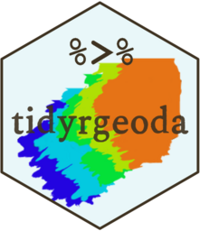
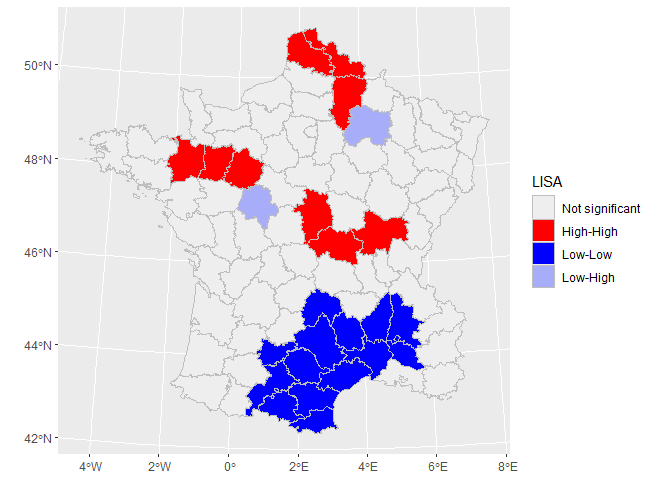

<!-- README.md is generated from README.Rmd. Please edit that file -->

# tidyrgeoda 

<!-- badges: start -->
<!-- badges: end -->

The goal of **tidyrgeoda** is to provide an interface for **rgeoda** to
integrate with **sf** objects and the **tidyverse**.

## Installation

You can install the development version of `tidyrgeoda` like so:

``` r
# install.packages("devtools")
devtools::install_github("SpatLyu/tidyrgeoda",build_vignettes = T,dep = T)
```

## Example

This is a basic example which shows you how to use `tidyrgeoda` to
create a `spatial weight matrix` and calculate the `local_moran`:

``` r
library(sf)
## Linking to GEOS 3.12.1, GDAL 3.8.4, PROJ 9.3.1; sf_use_s2() is TRUE
```

``` r
library(tidyverse)
## ── Attaching core tidyverse packages ──────────────────────── tidyverse 2.0.0 ──
## ✔ dplyr     1.1.4     ✔ readr     2.1.5
## ✔ forcats   1.0.0     ✔ stringr   1.5.1
## ✔ ggplot2   3.5.1     ✔ tibble    3.2.1
## ✔ lubridate 1.9.3     ✔ tidyr     1.3.1
## ✔ purrr     1.0.2
## ── Conflicts ────────────────────────────────────────── tidyverse_conflicts() ──
## ✖ dplyr::filter() masks stats::filter()
## ✖ dplyr::lag()    masks stats::lag()
## ℹ Use the conflicted package (<http://conflicted.r-lib.org/>) to force all conflicts to become errors
```

``` r
library(tidyrgeoda)
## Welcome to tidyrgeoda 0.1.0!
```

``` r

guerry = read_sf(system.file("extdata","Guerry.shp",package = "rgeoda"))
guerry %>% 
  mutate(lisa = st_local_moran(.,'Crm_prs',
                               wt = st_weights(.,'contiguity',queen = T))) %>% 
  select(lisa) -> g_lisa
g_lisa
## Simple feature collection with 85 features and 1 field
## Geometry type: MULTIPOLYGON
## Dimension:     XY
## Bounding box:  xmin: 47680 ymin: 1703258 xmax: 1031401 ymax: 2677441
## Projected CRS: NTF (Paris) / Lambert zone II
## # A tibble: 85 × 2
##    lisa                                                                 geometry
##    <fct>                                                      <MULTIPOLYGON [m]>
##  1 Not significant (((801150 2092615, 800669 2093190, 800688 2095430, 800780 20…
##  2 High-High       (((729326 2521619, 729320 2521230, 729280 2518544, 728751 25…
##  3 High-High       (((710830 2137350, 711746 2136617, 712430 2135212, 712070 21…
##  4 Not significant (((882701 1920024, 882408 1920733, 881778 1921200, 881526 19…
##  5 Not significant (((886504 1922890, 885733 1922978, 885479 1923276, 883061 19…
##  6 Low-Low         (((747008 1925789, 746630 1925762, 745723 1925138, 744216 19…
##  7 Not significant (((818893 2514767, 818614 2514515, 817900 2514467, 817327 25…
##  8 Low-Low         (((509103 1747787, 508820 1747513, 508154 1747093, 505861 17…
##  9 Not significant (((775400 2345600, 775068 2345397, 773587 2345177, 772940 23…
## 10 Low-Low         (((626230 1810121, 626269 1810496, 627494 1811321, 627681 18…
## # ℹ 75 more rows
```

``` r

ggplot(data = g_lisa) +
  geom_sf(aes(fill = lisa),lwd = .1,color = 'grey') +
  scale_fill_lisa()
```


