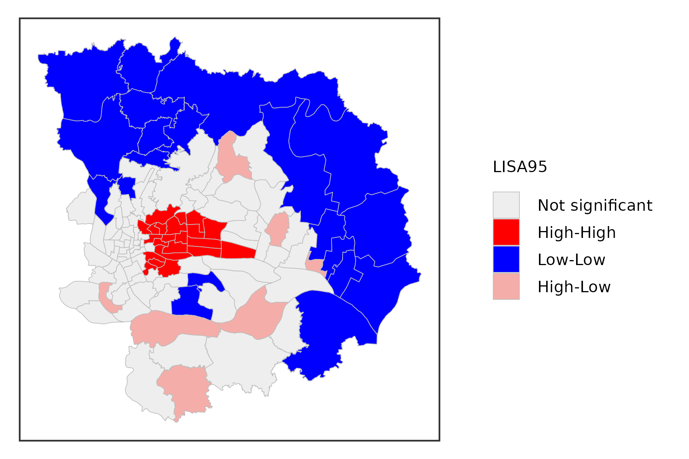
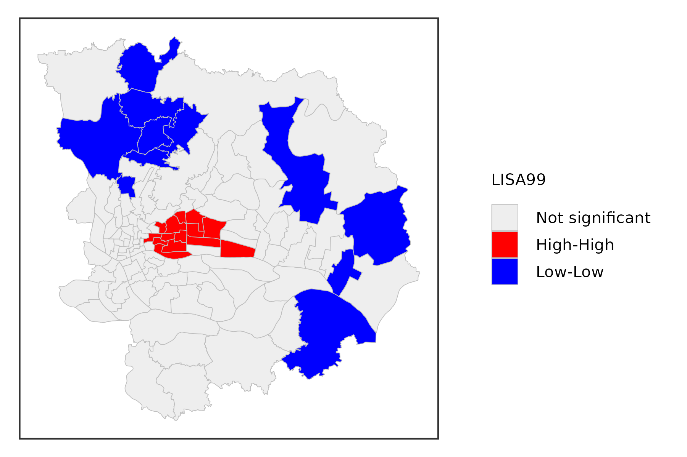
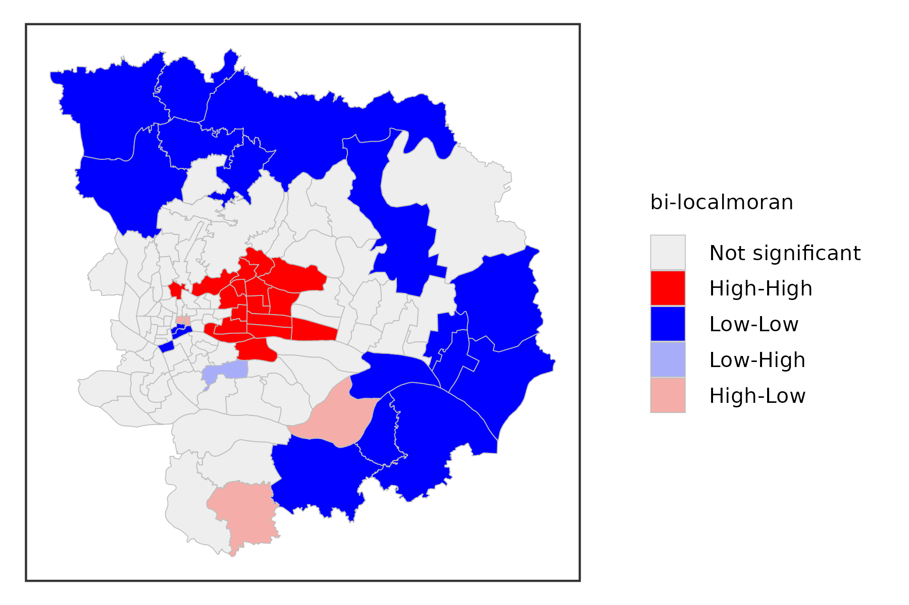
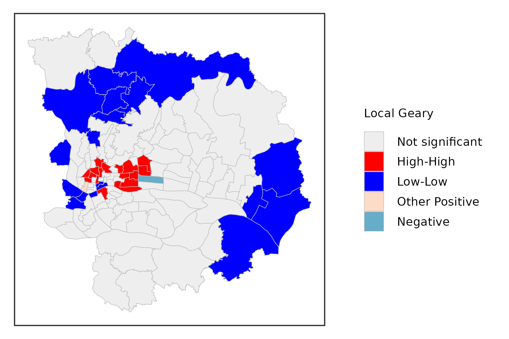
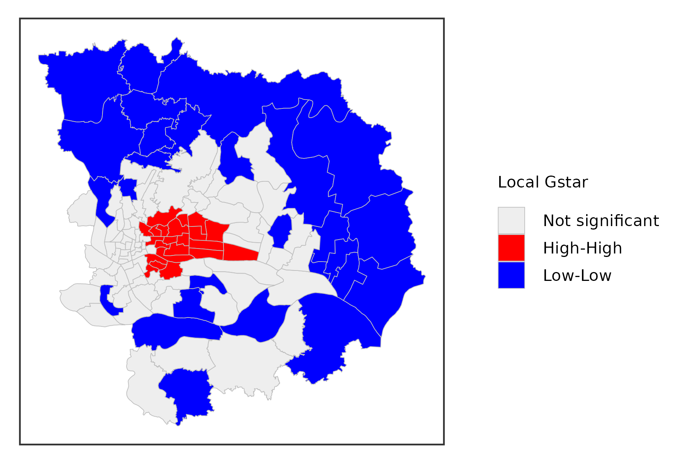
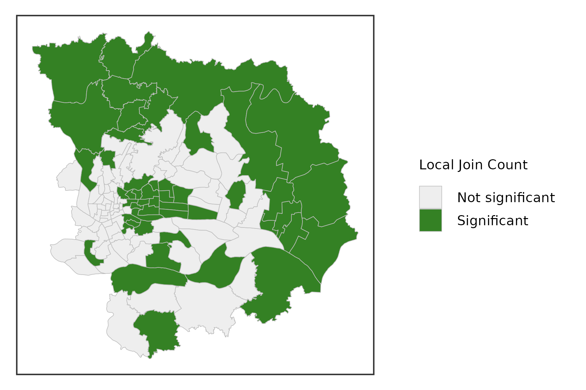

# Local Indicators of Spatial Association(LISA)

`tidyrgeoda` provides following methods for local spatial
autocorrelation statistics by invoking `rgeoda`:

- Local Moran:
  [`st_local_moran()`](https://spatlyu.github.io/tidyrgeoda/reference/st_local_moran.md),
  [`st_local_moran_eb()`](https://spatlyu.github.io/tidyrgeoda/reference/st_local_moran_eb.md),
  [`st_local_bimoran()`](https://spatlyu.github.io/tidyrgeoda/reference/st_local_bimoran.md)
- Local Geary:
  [`st_local_geary()`](https://spatlyu.github.io/tidyrgeoda/reference/st_local_geary.md),
  [`st_local_multigeary()`](https://spatlyu.github.io/tidyrgeoda/reference/st_local_multigeary.md)
- Local Getis-Ord statistics:
  [`st_local_g()`](https://spatlyu.github.io/tidyrgeoda/reference/st_local_g.md)
  and
  [`st_local_gstar()`](https://spatlyu.github.io/tidyrgeoda/reference/st_local_gstar.md)
- Local Join Count:
  [`st_local_joincount()`](https://spatlyu.github.io/tidyrgeoda/reference/st_local_joincount.md),
  [`st_local_bijoincount()`](https://spatlyu.github.io/tidyrgeoda/reference/st_local_bijoincount.md),
  [`st_local_multijoincount()`](https://spatlyu.github.io/tidyrgeoda/reference/st_local_multijoincount.md).
- Quantile LISA:
  [`st_local_quantilelisa()`](https://spatlyu.github.io/tidyrgeoda/reference/st_local_quantilelisa.md),
  [`st_local_multiquantilelisa()`](https://spatlyu.github.io/tidyrgeoda/reference/st_local_multiquantilelisa.md)
- Local Neighbor Match Test:
  [`st_lnmt()`](https://spatlyu.github.io/tidyrgeoda/reference/st_lnmt.md)

For more information about the local spatial autocorrelation
statisticis, please read Dr. Luc Anselin’s lab notes
[here](http://geodacenter.github.io/workbook/6a_local_auto/lab6a.md).

This vignette references some content from [Hands-On Spatial Data
Science with
R](https://spatialanalysis.github.io/handsonspatialdata/index.html).

### Load data and package.

We will use the `gzma` data in `tidyrgeoda` package,more details to see
[`?gzma`](https://spatlyu.github.io/tidyrgeoda/reference/gzma.md).

``` r
library(sf)
library(dplyr)
library(ggplot2)
library(tidyrgeoda)

data(gzma)
head(gzma)
```

    ## Simple feature collection with 6 features and 32 fields
    ## Geometry type: POLYGON
    ## Dimension:     XY
    ## Bounding box:  xmin: 12605340 ymin: 2645065 xmax: 12614330 ymax: 2653022
    ## Projected CRS: Popular Visualisation CRS / Mercator
    ## # A tibble: 6 × 33
    ##   SName_EN       DName_EN SSQ_Score PS_Score EL_Score OH_Score IL_Score FPOP_Pro
    ##   <chr>          <chr>        <dbl>    <dbl>    <dbl>    <dbl>    <dbl>    <dbl>
    ## 1 Datang Subdis… Yuexiu …      43.5     7.21     4.64     4.75     2.64    0.202
    ## 2 Kuangquan Sub… Yuexiu …      29.3     3.55     3.81     3.91     4.06    0.716
    ## 3 Dadong Subdis… Yuexiu …      51.2     7.94     4.69     4.86     3.31    0.215
    ## 4 Donghu Subdis… Yuexiu …      57.0     8.22     4.93     4.92     3.74    0.178
    ## 5 Baiyun Subdis… Yuexiu …      60.4     7.84     4.74     4.98     4.69    0.300
    ## 6 Huale Subdist… Yuexiu …      59.3     8.12     5.13     4.98     3.92    0.231
    ## # ℹ 25 more variables: TenantsPro <dbl>, NoSchPro <dbl>, PSchPRO <dbl>,
    ## #   JHSchPro <dbl>, HSchDipPro <dbl>, CDegreePro <dbl>, UnderG_Pro <dbl>,
    ## #   PostG_Pro <dbl>, RPSOPMOPro <dbl>, PCE_Pro <dbl>, ProTechPro <dbl>,
    ## #   ClerkPro <dbl>, BusSer_Pro <dbl>, AFAFP_Pro <dbl>, OPTE_Pro <dbl>,
    ## #   UnemPeoPro <dbl>, B100_Pro <dbl>, `100_200Pro` <dbl>, `200_500Pro` <dbl>,
    ## #   `500_1000P` <dbl>, `1000_1500P` <dbl>, `1500_2000P` <dbl>,
    ## #   `2000_3000P` <dbl>, A3000_Pro <dbl>, geometry <POLYGON [m]>

### Local Moran

The local Moran statistic was suggested in Anselin(1995) as a way to
identify local clusters and local spaital outliers. Most global spatial
autocorrelation can be expressed as a double sum over \\i\\ and \\j\\
indices, such as \\\sum_i\sum_j g\_{ij}\\.The local form of such a
statistic would then be, for each observation(location)\\i\\, the sum of
the relevant expression over the \\j\\ index, \\\sum_j g\_{ij}\\.

Specifically, the local Moran statistic takes the form \\cz_i\sum_j
\omega\_{ij}z_j\\, with \\z\\ in deviations from the mean. The scalar c
is the same for all locations and therefore does not play a role in the
assessment of significance. The latter is obtained by means of a
conditional permutation method, where, in turn, each \\z_i\\ is held
fixed, and the remaining z-values are randomly permuted to yield a
reference distribution for the statistic. This operates in the same
fashion as for the global Moran’s I, except that the permutation is
carried out for each observation in turn. The result is a pseudo p-value
for each location, which can then be used to assess significance. Note
that this notion of significance is not the standard one, and should not
be interpreted that way (see the discussion of multiple comparisons
below).

Assessing significance in and of itself is not that useful for the Local
Moran. However, when an indication of significance is combined with the
location of each observation in the Moran Scatterplot, a very powerful
interpretation becomes possible. The combined information allows for a
classification of the significant locations as high-high and low-low
spatial clusters, and high-low and low-high spatial outliers. It is
important to keep in mind that the reference to high and low is relative
to the mean of the variable, and should not be interpreted in an
absolute sense.

Now,we use `SSQ_Score` in `gzma` data as an example:

*significance level at 0.05:*

``` r
gzma %>% 
  mutate(lisa = st_local_moran(.,'SSQ_Score',
                               wt = st_contiguity_weights(.),
                               significance_cutoff = 0.05)) %>% 
  select(lisa) %>% 
  ggplot() +
  geom_sf(aes(fill = lisa),lwd = .1,color = 'grey') +
  scale_fill_lisa(name = 'LISA95') +
  theme_bw() +
  theme(
    axis.text = element_blank(),
    axis.ticks = element_blank(),
    axis.title = element_blank(),
    panel.grid = element_blank(),
    legend.title = element_text(size = 5),
    legend.text = element_text(size = 5),
    legend.key.size = unit(.3, 'cm')
  )
```



*significance level at 0.01:*

``` r
gzma %>% 
  mutate(lisa = st_local_moran(.,'SSQ_Score',
                               wt = st_contiguity_weights(.),
                               significance_cutoff = 0.01)) %>% 
  select(lisa) %>% 
  ggplot() +
  geom_sf(aes(fill = lisa),lwd = .1,color = 'grey') +
  scale_fill_lisa(name = 'LISA99') +
  theme_bw() +
  theme(
    axis.text = element_blank(),
    axis.ticks = element_blank(),
    axis.title = element_blank(),
    panel.grid = element_blank(),
    legend.title = element_text(size = 5),
    legend.text = element_text(size = 5),
    legend.key.size = unit(.3, 'cm')
  )
```



*Bivariate Local Moran Statistics*

``` r
gzma %>% 
  mutate(lisa = st_local_bimoran(.,c('OH_Score','IL_Score'),
                               wt = st_contiguity_weights(.),
                               significance_cutoff = 0.05)) %>% 
  select(lisa) %>% 
  ggplot() +
  geom_sf(aes(fill = lisa),lwd = .1,color = 'grey') +
  scale_fill_lisa(name = 'bi-localmoran') +
  theme_bw() +
  theme(
    axis.text = element_blank(),
    axis.ticks = element_blank(),
    axis.title = element_blank(),
    panel.grid = element_blank(),
    legend.title = element_text(size = 5),
    legend.text = element_text(size = 5),
    legend.key.size = unit(.3, 'cm')
  )
```



### Local Geary

The Local Geary statistic, first outlined in Anselin (1995), and further
elaborated upon in Anselin (2018), is a Local Indicator of Spatial
Association (LISA) that uses a different measure of attribute
similarity. As in its global counterpart, the focus is on squared
differences, or, rather, dissimilarity. In other words, small values of
the statistics suggest positive spatial autocorrelation, whereas large
values suggest negative spatial autocorrelation.

Formally, the Local Geary statistic is \\LG_i = \sum_j \omega\_{ij}
{(x_i - x_j)}^2\\ in the usual notation.

Inference is again based on a conditional permutation procedure and is
interpreted in the same way as for the Local Moran statistic. However,
the interpretation of significant locations in terms of the type of
association is not as straightforward. In essence, this is because the
attribute similarity is not a cross-product and thus has no direct
correspondence with the slope in a scatter plot. Nevertheless, we can
use the linking capability within GeoDa to make an incomplete
classification.

Those locations identified as significant and with the Local Geary
statistic smaller than its mean, suggest positive spatial
autocorrelation (small differences imply similarity). For those
observations that can be classified in the upper-right or lower-left
quadrants of a matching Moran scatter plot, we can identify the
association as high-high or low-low. However, given that the squared
difference can cross the mean, there may be observations for which such
a classification is not possible. We will refer to those as other
positive spatial autocorrelation.

For negative spatial autocorrelation (large values imply dissimilarity),
it is not possible to assess whether the association is between high-low
or low-high outliers, since the squaring of the differences removes the
sign.

``` r
gzma %>% 
  mutate(lg = st_local_geary(.,'SSQ_Score',
                             wt = st_contiguity_weights(.),
                             significance_cutoff = 0.01)) %>% 
  select(lg) %>% 
  ggplot() +
  geom_sf(aes(fill = lg),lwd = .1,color = 'grey') +
  scale_fill_lisa(name = 'Local Geary') +
  theme_bw() +
  theme(
    axis.text = element_blank(),
    axis.ticks = element_blank(),
    axis.title = element_blank(),
    panel.grid = element_blank(),
    legend.title = element_text(size = 5),
    legend.text = element_text(size = 5),
    legend.key.size = unit(.3, 'cm')
  )
```



### Local Getis-Ord Statistics

A third class of statistics for local spatial autocorrelation was
suggested by Getis and Ord (1992), and further elaborated upon in Ord
and Getis (1995). It is derived from a point pattern analysis logic. In
its earliest formulation the statistic consisted of a ratio of the
number of observations within a given range of a point to the total
count of points. In a more general form, the statistic is applied to the
values at neighboring locations (as defined by the spatial weights).
There are two versions of the statistic. They differ in that one takes
the value at the given location into account, and the other does not.

The \\G_i\\ statistic consists of a ratio of the weighted average of the
values in the neighboring locations, to the sum of all values, not
including the value at the location \\x_i\\. \\ G_i = \frac{\sum\_{j\neq
i}\omega\_{ij}x_j}{\sum\_{j\neq i}x_j} \\

In contrast, the \\G_i^\*\\ statistic includes the value \\x_i\\ in
numerator and denominator: \\ G_i^\* =
\frac{\sum_j\omega\_{ij}x_j}{\sum_jx_j} \\

Note that in this case, the denominator is constant across all
observations and simply consists of the total sum of all values in the
data set.

The interpretation of the Getis-Ord statistics is very straightforward:
a value larger than the mean (or, a positive value for a standardized
z-value) suggests a high-high cluster or hot spot, a value smaller than
the mean (or, negative for a z-value) indicates a low-low cluster or
cold spot. In contrast to the Local Moran and Local Geary statistics,
the Getis-Ord approach does not consider spatial outliers.

Inference is based on conditional permutation, using an identical
procedure as for the other statistics.

``` r
gzma %>% 
  mutate(lg = st_local_g(.,'SSQ_Score',
                             wt = st_contiguity_weights(.),
                             significance_cutoff = 0.05)) %>% 
  select(lg) %>% 
  ggplot() +
  geom_sf(aes(fill = lg),lwd = .1,color = 'grey') +
  scale_fill_lisa(name = 'Local G') +
  theme_bw() +
  theme(
    axis.text = element_blank(),
    axis.ticks = element_blank(),
    axis.title = element_blank(),
    panel.grid = element_blank(),
    legend.title = element_text(size = 5),
    legend.text = element_text(size = 5),
    legend.key.size = unit(.3, 'cm')
  )
```


``` r
gzma %>% 
  mutate(lg = st_local_gstar(.,'SSQ_Score',
                             wt = st_contiguity_weights(.),
                             significance_cutoff = 0.05)) %>% 
  select(lg) %>% 
  ggplot() +
  geom_sf(aes(fill = lg),lwd = .1,color = 'grey') +
  scale_fill_lisa(name = 'Local Gstar') +
  theme_bw() +
  theme(
    axis.text = element_blank(),
    axis.ticks = element_blank(),
    axis.title = element_blank(),
    panel.grid = element_blank(),
    legend.title = element_text(size = 5),
    legend.text = element_text(size = 5),
    legend.key.size = unit(.3, 'cm')
  )
```



### Local Join Count Statistic

Recently, Anselin and Li (2019) showed how a constrained version of the
\\G_i^\*\\ statistic yields a local version of the well-known join count
statistic for spatial autocorrelation of binary variables, popularized
by Cliff and Ord (1973). Expressed as a LISA statistic, a local version
of the so-called BB join count statistic is \\ BB_i =
x_i\sum_j\omega\_{ij}x_j \\

where \\x\_{i,j}\\ can only take on the values of 1 and 0, and
\\\omega\_{ij}\\ are the elements of a binary spatial weights matrix
(i.e., not row-standardized). For the most meaningful results, the value
of 1 should be chosen for the case with the fewest observations (of
course, the definition of what is 1 and 0 can easily be switched).

The statistic is only meaningful for those observations where \\x_i =
1\\, since for \\x_i = 0\\ the result will always equal zero. A pseudo
p-value is obtained by means of a conditional permutation approach, in
the same way as for the other local spatial autocorrelation statistics,
but only for those observations with \\x_i = 1\\. The same caveats as
before should be kept in mind when interpreting the results, which are
subject to multiple comparisons and the sensitivity of the pseudo
p-value to the actual simulation experiment (random seed, number of
permutations). Technical details are provided in Anselin and Li (2019).

``` r
gzma %>% 
  mutate(lg = st_local_joincount(.,'SSQ_Score',
                                 wt = st_contiguity_weights(.),
                                 significance_cutoff = 0.05)) %>% 
  select(lg) %>% 
  ggplot() +
  geom_sf(aes(fill = lg),lwd = .1,color = 'grey') +
  scale_fill_lisa(name = 'Local Join Count') +
  theme_bw() +
  theme(
    axis.text = element_blank(),
    axis.ticks = element_blank(),
    axis.title = element_blank(),
    panel.grid = element_blank(),
    legend.title = element_text(size = 5),
    legend.text = element_text(size = 5),
    legend.key.size = unit(.3, 'cm')
  )
```


